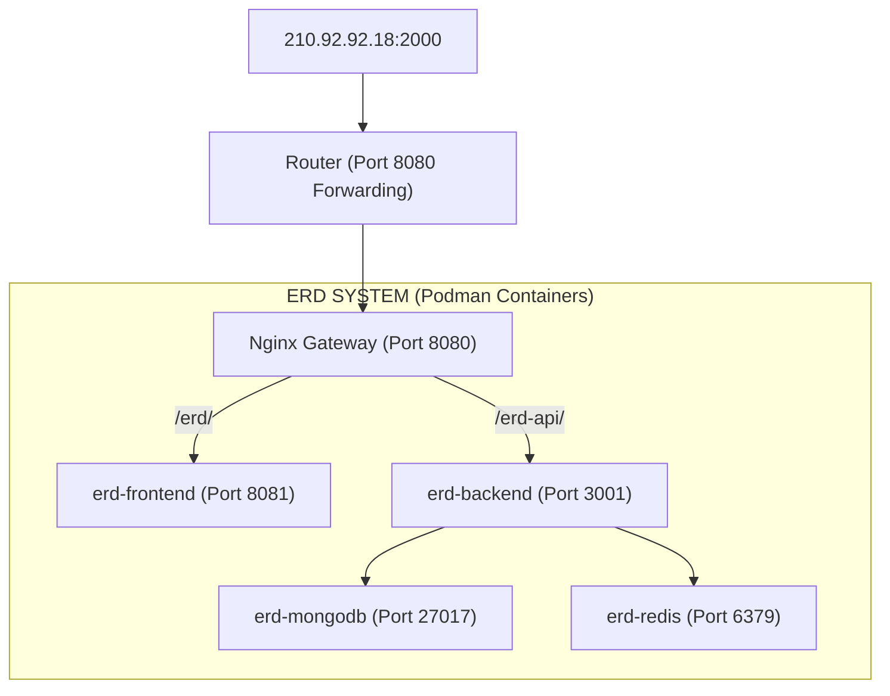

# Production Deployment Walkthrough

ERD SYSTEM을 운영 서버(`210.92.92.18:2000`)의 경로 기반 라우팅 환경에 맞춰 배포하기 위한 설정이 완료되었습니다.

---

## 🏗 전체 구성도 (Architecture)


---

## 🛠 배포 준비 사항

### 1. 환경 설정 확인
- **프론트엔드**: `.env.production` 파일이 생성되었으며, `npm run build` 시 자동으로 적용됩니다.
- **백엔드**: `docker-compose.yml`의 `environment` 섹션에서 DB 및 Redis 연결 정보를 컨테이너 이름(`mongodb`, `redis`)으로 설정했습니다.

---

## 🚀 운영 서버 셋팅 가이드 (Step-by-Step)

### 단계 1: 소스 코드 및 설정 파일 전송
운영 서버(`192.168.0.141`)로 프로젝트 전체 파일을 전송합니다. `.env.production`, `Dockerfile`, `docker-compose.yml`이 포함되어야 합니다.

```bash
# 로컬 개발 PC에서 실행 (예시)
scp -P 22222 -r ./ERD-SYSTEM vims@192.168.0.141:~/
```

### 단계 2: 컨테이너 실행 (Podman)
운영 서버 내부에서 `erd-system` 디렉토리로 이동한 후 실행합니다. 외부 회선이 막혀있다면 미리 빌드된 이미지를 가져오거나 내부 레지스트리를 사용해야 할 수 있습니다.

```bash
cd ~/ERD-SYSTEM

# 모든 서비스 빌드 및 실행
podman-compose up -d --build
```
> [!NOTE]
> `podman ps` 명령어로 4개의 컨테이너(`erd-mongodb`, `erd-redis`, `erd-backend`, `erd-frontend`)가 정상 작동 중인지 확인하세요.

### 단계 3: Nginx Gateway (Port 8080) 설정 업데이트
현재 다른 프로젝트들이 사용하는 방식인 **`host.containers.internal` 루프백**을 활용하여 `nginx_web` 설정에 아래 내용을 추가합니다.

```nginx
server {
    listen 8080;
    server_name _;

    # 1. ERD 프론트엔드 연결
    location /erd/ {
        # 호스트 OS의 8085 포트로 연결
        proxy_pass http://host.containers.internal:8085/erd/;
        proxy_set_header Host $host;
        proxy_set_header X-Real-IP $remote_addr;
        proxy_set_header X-Forwarded-For $proxy_add_x_forwarded_for;
    }

    # 2. ERD 백엔드 및 실시간 소켓 연결
    location /erd-api/ {
        rewrite ^/erd-api/(.*)$ /$1 break;
        # 호스트 OS의 3001 포트로 연결
        proxy_pass http://host.containers.internal:3001;
        
        proxy_http_version 1.1;
        proxy_set_header Upgrade $http_upgrade;
        proxy_set_header Connection "upgrade";
        
        proxy_set_header Host $host;
        proxy_set_header X-Real-IP $remote_addr;
        proxy_set_header X-Forwarded-For $proxy_add_x_forwarded_for;
    }
}
```

> [!TIP]
> **보안**: 외부에서 `8085`나 `3001` 포트로 직접 접속하는 것은 방화벽(Router)에서 막혀있으므로, 반드시 `2000`번 포트의 Nginx를 통해서만 ERD SYSTEM에 접근하게 됩니다. 이는 현재 운영 서버의 다른 프로젝트들과 동일한 보안 구조입니다.

> [!IMPORTANT]
> **네트워크 연결**: `nginx_web` 컨테이너가 `erd-frontend`, `erd-backend` 컨테이너의 이름을 인식하려면 이 서비스들이 **동일한 Podman 네트워크**에 속해 있어야 합니다.
> 
> ```bash
> # nginx_web의 네트워크 확인
> podman inspect nginx_web --format='{{.NetworkSettings.Networks}}'
> ```
> 확인된 네트워크 이름을 `docker-compose.yml` 하단에 추가하고 각 서비스에서 연결해 주어야 합니다.

### 단계 4: Nginx 설정 재로드
```bash
sudo nginx -t          # 설정 문법 검사
sudo nginx -s reload   # 설정 반영
```

---

## ✅ 확인 방법
1.  **접속**: 브라우저에서 `http://210.92.92.18:2000/erd/` 주소로 접속합니다.
2.  **로그인**: 로그인 기능이 정상 작동(백엔드 통신) 하는지 확인합니다.
3.  **협업**: 다른 브라우저 창을 열어 실시간 커서 및 엔티티 동기화가 되는지 확인합니다.
